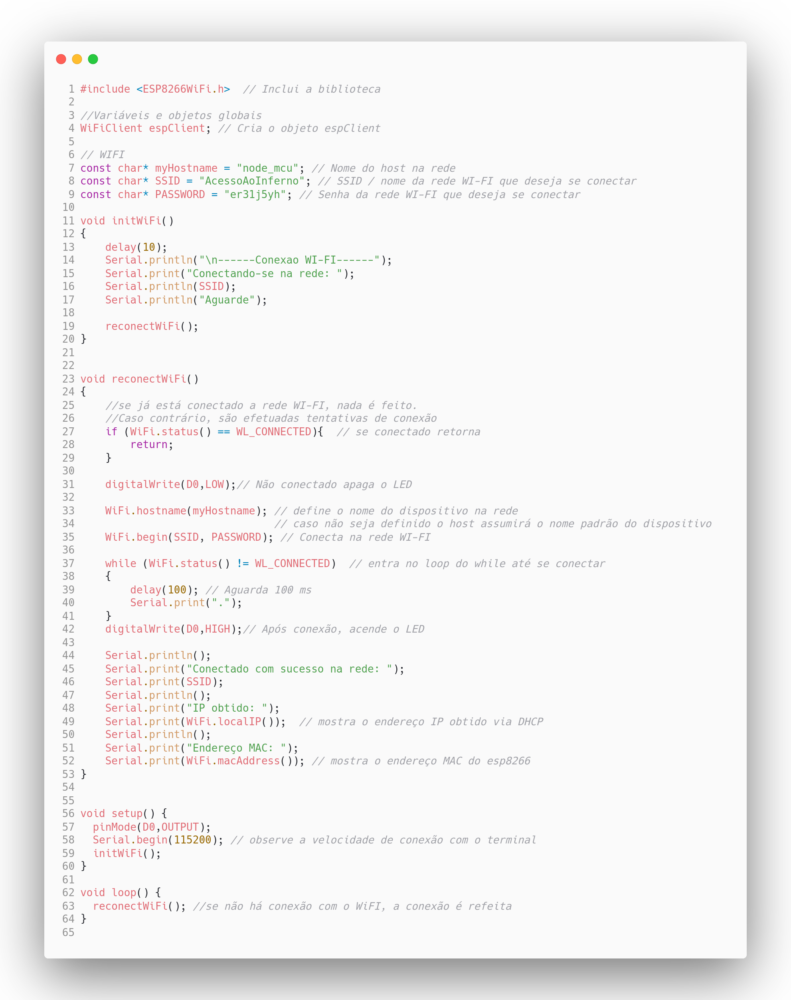
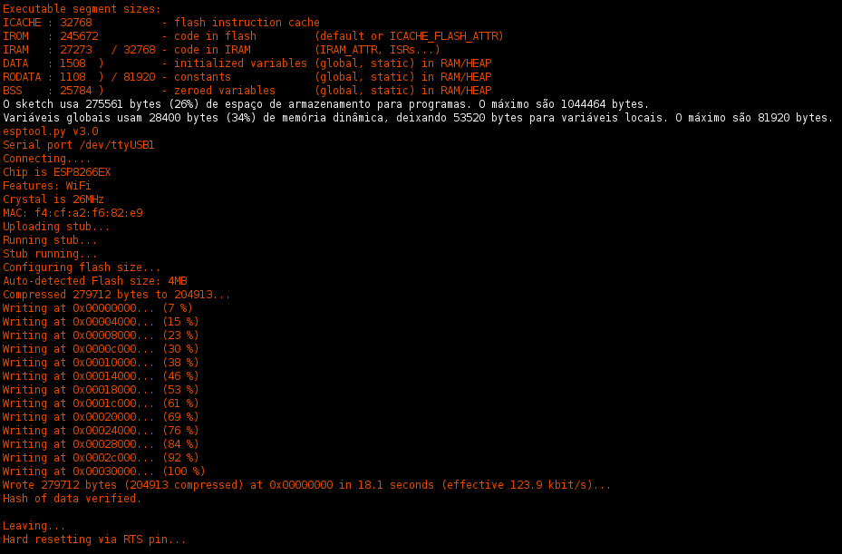
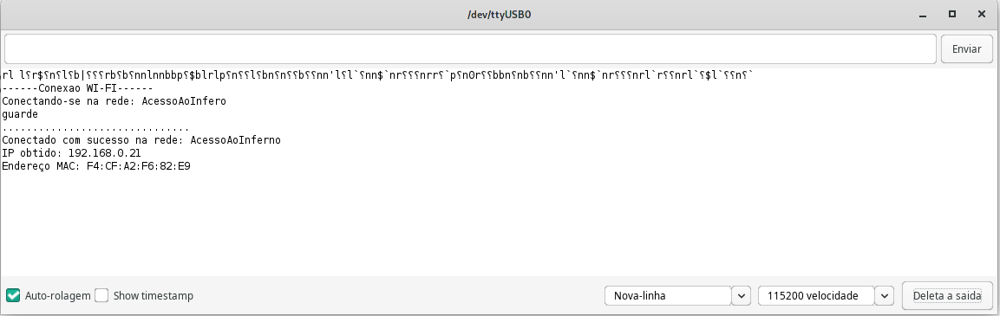

# 2ª. Atividade Avaliativa

## 

### Professor: Carlos Otávio Schocair Mendes

### Aluno: Nicolas Vycas Nery

## Conteúdo
* Programa contido no arquivo Pratica-2-WiFi.ino
* Monitor Serial
* Video Com o Programa Executado

## Programa contido no arquivo Pratica-2-WiFi.ino

O programa abaixo é um exemplo de como o Node MCU pode se conectar a uma rede WiFi.

Ele possui uma função, reconectWifi, que faz a conexão com a rede WiFi e se reconecta caso a conexão seja perdida.  

Também por todo o programa é utilizado funções para imprimir na Serial o status da conexão, o endereço IP , o MAC e o nome da rede.

Com o Node MCU conectado em uma porta usb, é possivel compilar e enviar o programa para o Node MCU.

A saida do compilador é a seguinte:

## Monitor Serial:

Apos o programa ser compilado e enviado para o Node MCU, e possivel alguma lider no monitor serial do Node MCU como na seguinte imagem:

## Video Com o Programa Executado:

[Link de video com o codigo rodando](https://youtu.be/EsD_c68FZxI)

