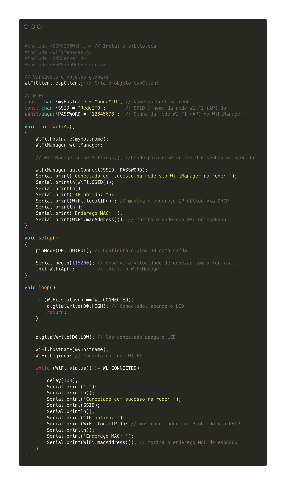
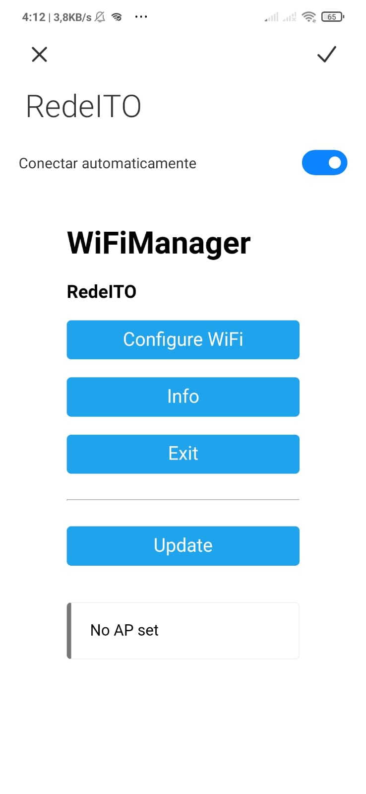

# 3ª. Atividade Avaliativa

## Prática sobre WiFi Manager

### Professor: Carlos Otávio Schocair Mendes

### Aluno: Nicolas Vycas Nery

## Conteúdo

* Baixar biblioteca WiFi Manager
* Programa utilizando wifi manager
* Conclusão

## Baixar biblioteca WiFi Manager

Para baixar a biblioteca WiFi Manager, bastou acessar o menu `Ferramentas`, opção `Gerenciador Bibliotecas`, buscar por `WifiManager tzapu` e instalar, como na imagem abaixo:

Apos instalado a biblioteca, é possivel utilizar o wifi manager.

## Programa utilizando wifi manager

O programa utilizando wifi manager, é o seguinte:

O programa configura o wifi manager para possuir o nome (SSID) `RedeITO`, a senha `12345678`, e o hostname `nodeMCU`. 

Durante o loop de execução, o programa verifica se à uma conexão e acende o LED caso verdade, caso contrário, apaga o LED ate que a conexão seja estabelecida.

O programa tambem imprime no monitor serial a informações da rede wifi, como o SSID, ip local e MAC.

Monitor serial:

Ao se conectar ao nodeMCU pelo celular via wifi, é exibido telas onde é possivel configurar a conexão, do NodeMCU.

Tela de conexão wifi do celular:

Tela de configuração do wifi manager:

## Conclusão

A Biblioteca WiFi Manager foi utilizada para configurar o wifi do NodeMCU atraves do celular. Oq permite que um dispositivo seja configurado na hora em que é ligado diferente da pratica anterior onde o o nodeMCU possuia informações estatica sobre qual rede wifi ele deveria conectar. 
