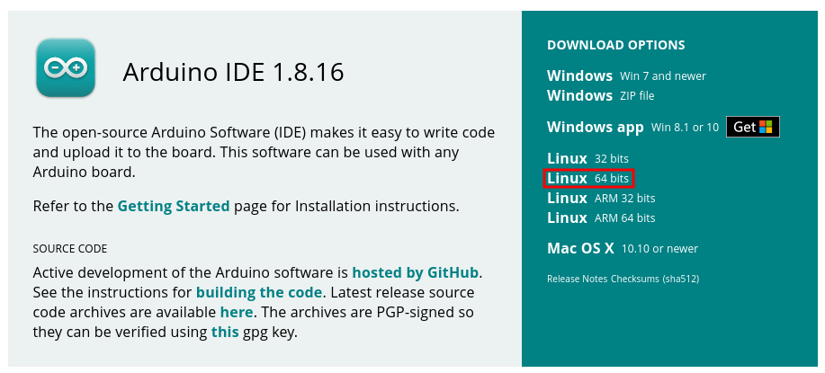
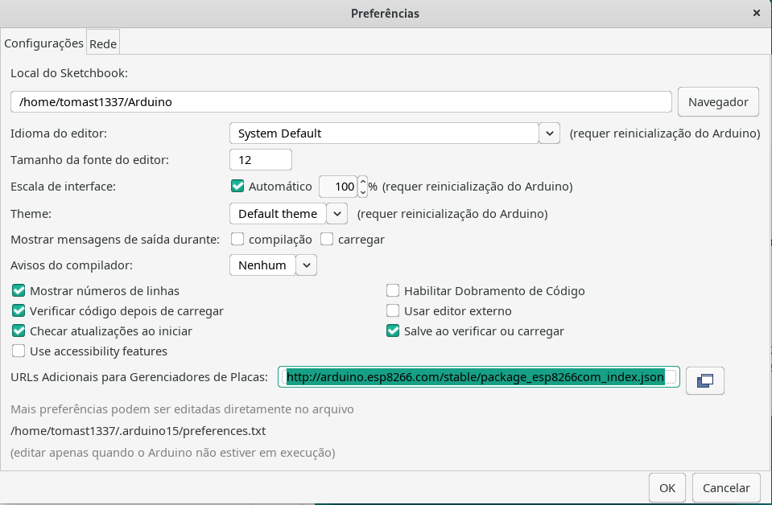
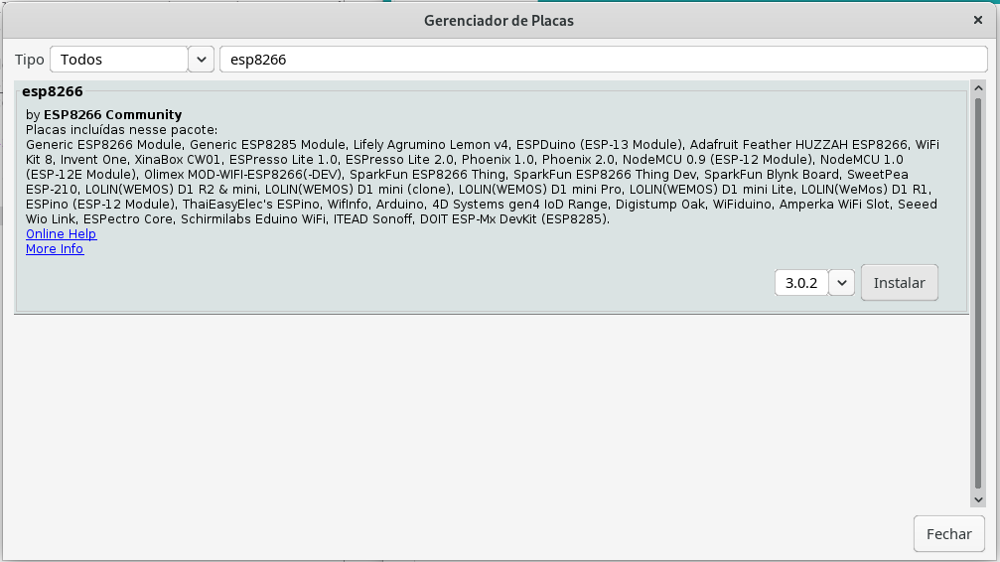
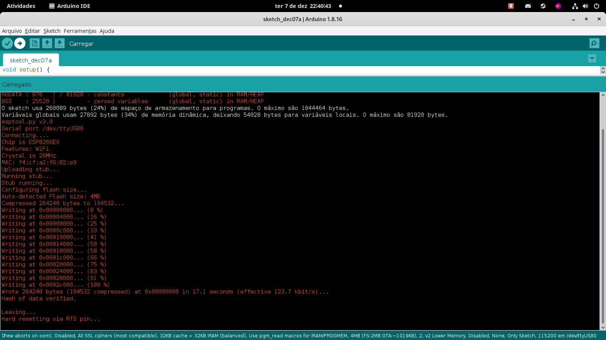

# 1ª. Atividade Avaliativa

## Instalação da IDE do Arduíno e compilar o seu primeiro programa

### Professor: Carlos Otávio Schocair Mendes

### Aluno: Nicolas Vycas Nery

## Conteúdo

* Introdução
* Instalação manual
* Instalação gerenciador de pacotes
* Configurando Arduino IDE para a utilização do ESP8266
* Compilando primeiro programa

## Introdução

## Instalação manual

Para a instalação manual, o instalador do Arduino IDE deve ser baixado e instalado através do seguinte pagina: https://www.arduino.cc/en/software ,

No meu caso foi escolhida a opção `Linux 64 bits` e o arquivo baixado foi o `arduino-1.8.16-linux64.tar.xz`.

Para descompactar o arquivo, basta digitar no terminal: `tar -xf arduino-1.8.16-linux64.tar.xz`.

Apos isso dentro do diretorio descompactado, basta executar o comando: `./install.sh` para instalar o IDE.

## Instalação gerenciador de pacotes

Estou usando o Arch/linux onde o gerenciador de pacotes padrão é o `pacman` então para instalar o Arduino IDE só foi necessário um passo, executar o comando `pacman -S arduino` com as permissões de root

No meu caso é preferível instalar com o gerenciador de pacotes pois é muito mais fácil gerenciar o programa , não preciso me preocupar em atualizar ou saber onde está script de desinstalação, o gerenciador de pacotes faz isso por mim

## Configurando Arduino IDE para a utilização do ESP8266

No meu caso, foi necessario executar o arquivo com root para poder ter acesso aos outros dispositivos.

Para configurar o Arduino IDE para a utilização do ESP8266 é necessário que você configure o arquivo a IDE para procurar o pacote `ESP8266`

Para fazer isso, primeiro acesse a tela de preferências que esta no menu `Arquivo` do Arduino IDE e adicione `http://arduino.esp8266.com/stable/package_esp8266com_index.json` no campo "URLs Adicionais para Gerenciador de Placas" como na imagem abaixo:

Após isso, é necessario buscar o pacote `ESP8266` e instalar o pacote através do `Gerenciador de Placas` que é encontrado dentro do menu `Ferramentas` na opção `Placa`.

Dentro do Gerenciador de Placas, é possivel procurar por `ESP8266` e instalar o pacote, como na imagem abaixo:

Agora é possível selecionar a placa 'NodeMCU 1.0' no menu `Ferramentas`.
Com isso feito, o Arduino IDE já está configurado para utilizar o `ESP8266`.

## Compilando primeiro programa

Até agora, nós conseguimos instalar o Arduino IDE e configurar o `ESP8266`, agora é só compilar o seu primeiro programa. Para isso, primeiro é necessário que seja selecionada a placa que está conectada ao computador através do menu `Ferramentas` na opção `Porta`. No meu caso no Linux a placa esta em `/dev/ttyUSB0`, após marcar essa opção é possível clicar em `Carregar` para compilar e carregar o seu programa no `ESP8266`, como na imagem abaixo:

