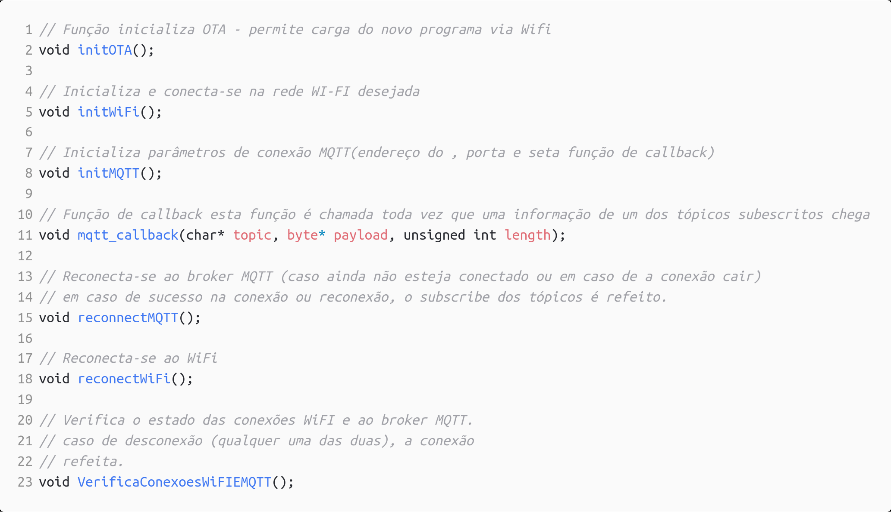
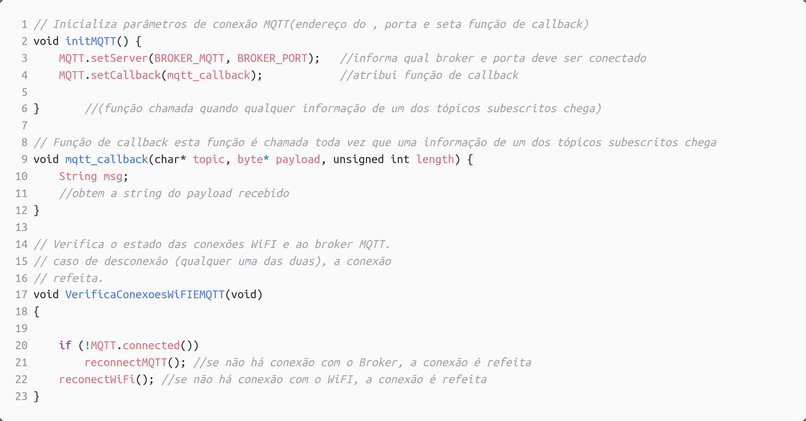
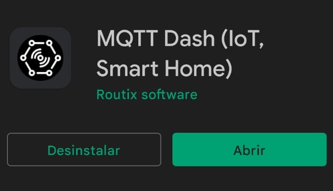
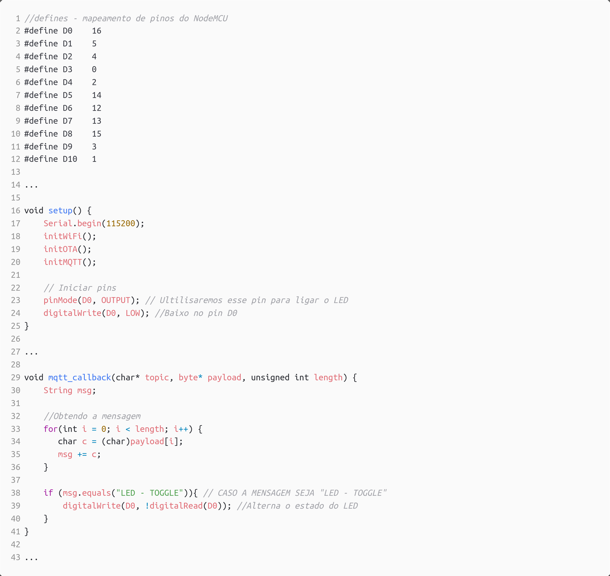
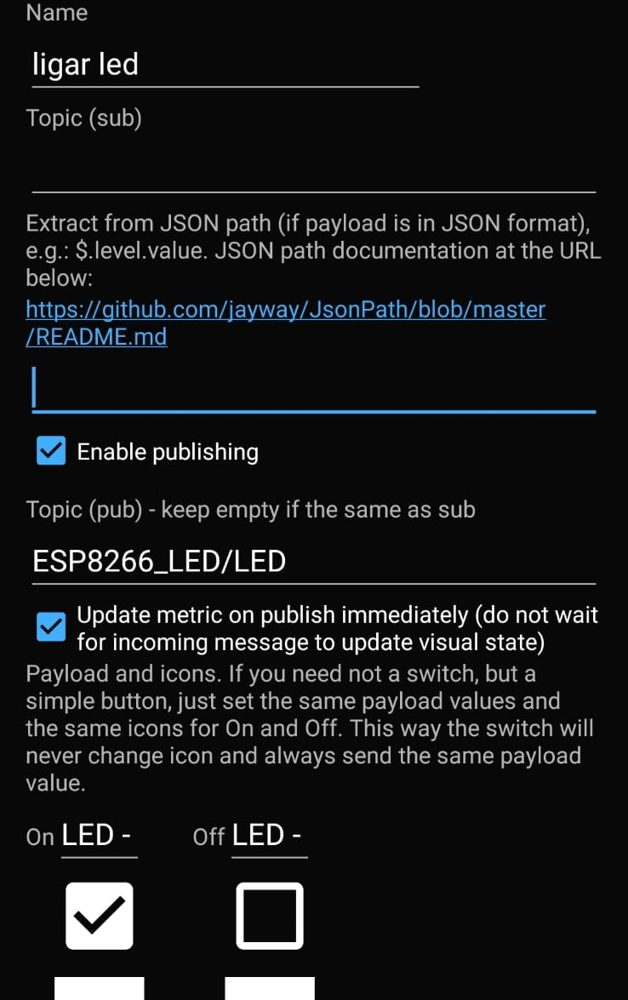
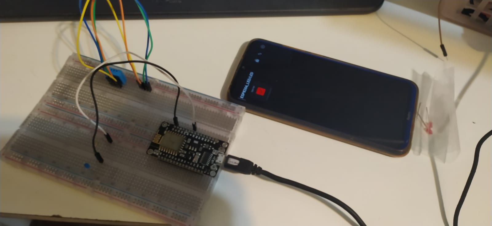

# 4ª Atividade Avaliativa

## Prática prática sobre OTA e MQTT 

### Professor: Carlos Otávio Schocair Mendes

### Aluno: Nicolas Vycas Nery
<!--  -->
## Conteúdo

* Oque é o MQTT?
* Instalação MQTT na Arduino IDE
* Oque é OTA?
* Instalação OTA no Arduino IDE
* Programa utilizando OTA e MQTT
* Utilizando OTA para enviar programas para o ESP8266
* Configuração do MQTT no ESP8266
* Utilizando MQTT para enviar e receber mensagens para o ESP8266
## Oque é o MQTT?

MQTT é um protocolo de comunicação de mensagens leves entre dispositivos, com ele podemos comunicar com dispositivos eles estando conectados a uma rede WiFi em qualquer lugar do mundo, isso torna o protocolo muito utilizado para comunicação entre dispositivos IOT. 

## Instalação MQTT na Arduino IDE

Para ultilizar o MQTT, é necessário abri o menu Ferramentas > Gerenciador de Bibliotecas, `no campo Refinar sua busca..` buscar por `PubSubClient`, é possível baixar como na imagem abaixo:

## Oque é OTA?

OTA é o processo de enviar, realizar o upload, de firmware para o ESP através de uma conexão WiFi ao invés da porta serial usb, trazendo uma grande diferença no desenvolvimento e atualização do firmware.

## Instalação OTA no Arduino IDE

Para instalar o OTA no Arduino IDE, é necessário abri o menu Ferramentas > Gerenciador de Bibliotecas, `no campo Refinar sua busca..` buscar por ArduinoOTA, e instalar a biblioteca como na imagem abaixo:

## Programa utilizando OTA e MQTT

 O servido MQTT que utilizei é o [Eclipse IOT](https://iot.eclipse.org/projects/getting-started/) que possui endereço `mqtt.eclipseprojects.io` e utiliza as portas `1883` e `8883`. Com tudo isso teremos isso em nosso programa que utilizará o MQTT:

Essas variáveis serão utilizadas nas funções declaradas abaixo:

O setup, e loop principal de nosso programa será o seguinte:

## Utilizando OTA para enviar programas para o ESP8266

Primeiro, antes de podermos enviar os programas para o ESP8266, através do OTA, é necessário configurar enviar um programa por cabo para o ESP8266 que adicione ao dispositivo a capacidade de receber programas via WiFi. utilizando o programa feito anteriormente, ja é possível fazer isso apos a definida da funções `void initOTA()` , `void reconectWiFi()` e `void initWiFi()` como abaixo no código:

Repare que na função `void initOTA()` é definido um hostname, e uma senha nas linhas 31 e 34, eles serão utilizados posteriormente para poder enviar o programa para o ESP8266.

Apos carregado os programa para o ESP8266, enquanto eles estiver ligado e na rede que foi definida sera possível enviar o programa para o ESP8266, selecionado um dispositivo , no menu Ferramentas > Portas > Portas de rede, como na imagem abaixo:

Ao carregar o programa para o ESP8266, sera pedido uma senha que foi definida em código anteriormente, e a senha será utilizada para poder enviar o programa para o ESP8266.

## Configuração do MQTT no ESP8266

Para que um programa possa usar a comunicação MQTT, é necessário configurar uma rede BROKER, que é um host que recebe as mensagens e as envia para os dispositivos, dar um ID e nome único ao dispositivo dento da rede broker, uma senha e um tópico que divide de onde o dispositivo irar receber as mensagens. Os dispositivos podem tanto publica mensagens para o broker, como receber mensagens do broker, através da biblioteca `PubSubClient` podemos configurar o ESP8266 para receber ou enviar mensagens do broker.

Observemos que dentro da função `mqtt_callback(char* topic, byte* payload, unsigned int length)` podemos receber o tópico, o payload e o tamanho da mensagem. utilizaremos ela posteriormente para receber as mensagens do broker.

## Instalação MQTT Dashboard:

MQTT Dashboard torna o celular em um dispositivo capaz de enviar e receber mensagens do broker MQTT,a instalação do MQTT Dashboard foi simples, foi baixado e instalado através da Google Play Store, como na imagem abaixo:

Apos a instalação e configuração do MQTT Dashboard, é possível utilizar o MQTT Dashboard para enviar e receber mensagens do broker MQTT.

## Utilizando MQTT para receber mensagens no ESP8266

Agora com essas funções definidas, é possível enviar e receber mensagens do broker. então vamos criar um programa que acende um led a cada vez que receber uma mensagem do broker.
Para isso teremos que fazer algumas modificações em nosso programa, como abaixo:

No MQTT Dashboard, vamos criar um novo dispositivo, com o nome `ESP8266_LED`, e a senha `12345678`, e um botão que posta um playload para o tópico `ESP8266_LED/LED`, como na imagem abaixo:

ao ser clicado o botão o payload,`LED - TOGGLE`, será recebido pelo ESP8266, e o LED será acionado, imagens do funcionamento no final.

## programa ultilizando Wifi Manager, OTA e MQTT.

Primeiro vamos começar com o Wifi Manager e OTA, vamos começar do programa base a baixo:

Agora vamos definir as funções, `void init_wifi_manager();`, `void reconect_wiFi();` e `void initOTA();`.

`void init_wifi_manager();`

")

`void reconect_wiFi();`

")

Observe que dentro da função `reconect_wiFi()` estamos utilizando o wifi manager para reconectar a rede, caso o ESP8266 não esteja conectado a rede.

`void initOTA();`.

")

Dentro das funções `void setup()` e `void loop()` teremos:

 e loop()")

Ao executar o programa o ESP8266 irá iniciar o Wifi Manager, e irá pedir uma senha para conectar a rede, caso o ESP8266 não esteja conectado a rede.
No monitor serial, podemos ver essa saída apos a conexão com a rede:

 e loop()")

É claro que se o programa for feito para um fim comercial, essa senha não seria mostrada.

É necessário adicionar algumas variáveis globais, como na imagem abaixo:

Agora iremos adicionar uma função com o mqtt, para isso o programa será modificado como abaixo:

 e loop()")

`void initMQTT()`

")

`void mqtt_callback(char* topic, byte* payload, unsigned int length)`

")

`void VerificaConexoesMQTT(void)`

")

Apos tudo isso possuímos um programa que irá enviar e receber mensagens do broker MQTT, e acender um led ao mesmo tempo que possui as capacidades do Wifi Manager e OTA.

Imagens funcionamento:

