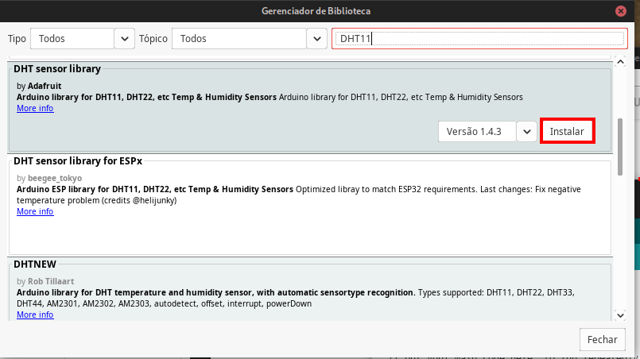
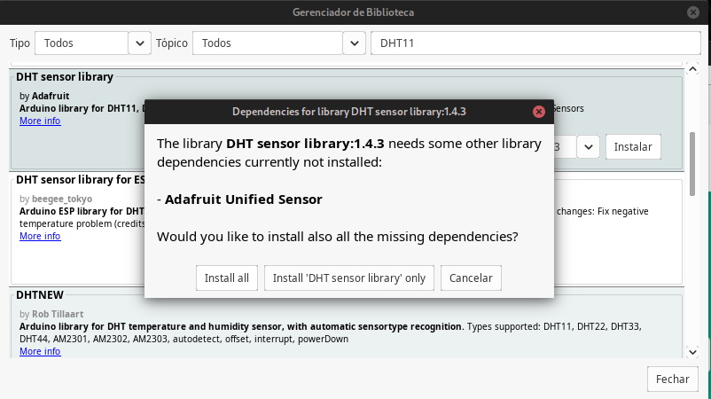
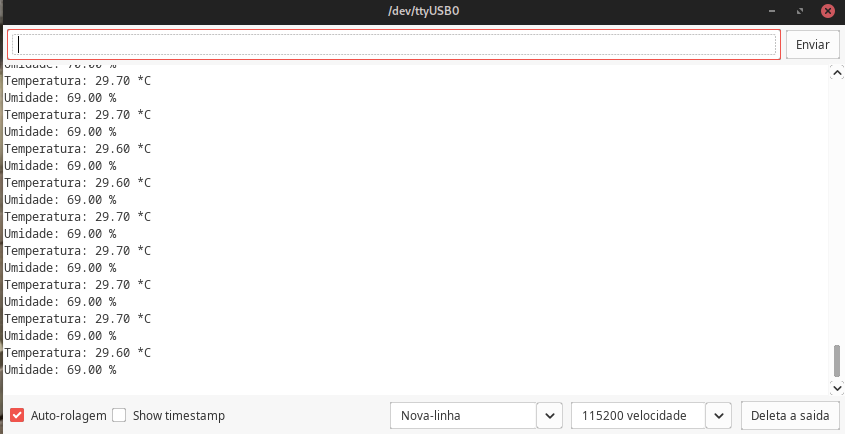
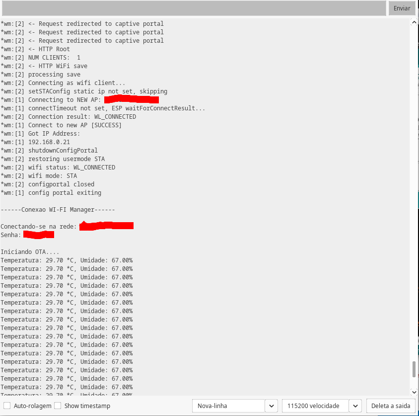

# 4ª Atividade Avaliativa

## Práticas com MQTT e DHT11 no ESP ESP8266

### Professor: Carlos Otávio Schocair Mendes

### Aluno: Nicolas Vycas Nery

## Conteúdo

* Oque é o MQTT?
* Instalação MQTT na Arduino IDE
* Oque é DHT11?
* Instalação DHT11 na Arduino IDE
* Programa simples utilizando o DHT11
* Programa utilizando o MQTT, OTA, WIFI Manager e DHT11 

## Oque é o MQTT?

Recapitulando a 4ª atividade, MQTT é um protocolo de comunicação de mensagens leves entre dispositivos, com ele podemos comunicar com dispositivos eles estando conectados a uma rede WiFi em qualquer lugar do mundo, isso torna o protocolo muito utilizado para comunicação entre dispositivos IOT. 

## Instalação MQTT na Arduino IDE

Para utilizar o MQTT, é necessário abri o menu Ferramentas > Gerenciador de Bibliotecas, `no campo Refinar sua busca..` buscar por `PubSubClient`, é possível baixar como na imagem abaixo:


## Oque é DHT11?

DHT11 é um sensor de temperatura e umidade que é utilizado para medir a temperatura e umidade do ambiente. Ele permite a leitura entre 0 e 50 graus Celsius e entre 0 e 100% de umidade. O DHT11 envia uma mensagem serial de 8 bits que para ser lida sera utilizado uma biblioteca.


## Instalação DHT11 na Arduino IDE

Para ultilizar o DHT11, é necessário abri o menu Ferramentas > Gerenciador de Bibliotecas, `no campo Refinar sua busca..` buscar por `DHT11`, e baixar a biblioteca `DHT sensor library`, como na imagem abaixo:



Na tentativa de instalação ser pedido para instalar a biblioteca `Adafruit Unified Sensor`.

 

## Programa simples utilizando o DHT11

Agora iremos fazer um program simples que imprime no monitor serial a temperatura e umidade do ambiente.

```c
#include <DHT.h>

#define D3  0

#define DHT_TYPE DHT11

DHT dht(D3, DHT_TYPE);

//Setup
void setup() {
    Serial.begin(115200); // Inicia porta serial
    dht.begin(); // Inicia o sensor DHT11
}

void loop() {
    float umidade = dht.readHumidity(); // Leitura da umidade
    float temperatura = dht.readTemperature(); // Leitura da temperatura
    Serial.print("Temperatura: ");
    Serial.print(temperatura);
    Serial.print(" *C");
    Serial.print("\n");
    Serial.print("Umidade: ");
    Serial.print(umidade);
    Serial.print(" %");
    Serial.print("\n");
    delay(1000); // Delay de 1 segundo
}
```

Ao executar o programa, será exibido no monitor serial a temperatura e umidade do ambiente, similares ao exemplo abaixo:



## Programa utilizando o MQTT, OTA, WIFI Manager e DHT11

Iremos começar utilizando o programa da pratica 4, onde ja temos o MQTT, OTA e WIFI Manager:

```c
#include <ESP8266WiFi.h>
#include <PubSubClient.h>
#include <ESP8266mDNS.h>
#include <WiFiManager.h>
#include <DNSServer.h>
#include <ESP8266WebServer.h>
#include <ArduinoOTA.h>

//Mapeamento de pinos do NodeMCU
#define D0    16
#define D1    5
#define D2    4
#define D3    0
#define D4    2
#define D5    14
#define D6    12
#define D7    13
#define D8    15
#define D9    3
#define D10   1

#define TOPICO_SUBSCRIBE_P1 "ESP8266_LED/LED"     //tópico MQTT de escuta luz 1
#define ID_MQTT  "mqtt_aula_nicolas_vycas_1"//id mqtt (para identificação de sessão deve ser unico)
#define USER_MQTT  "login"   // usuario no MQTT
#define PASS_MQTT  "12345"  // senha no MQTT 

#define PASS_OTA "teste-ota"

WiFiClient espClient; // Cria o objeto espClient
PubSubClient MQTT(espClient); // Instancia o Cliente MQTT passando o objeto espClient

// MQTT
const char* BROKER_MQTT = "mqtt.eclipseprojects.io"; //URL do broker MQTT que se deseja utilizar
int BROKER_PORT = 1883; // Porta do Broker MQTT


// WIFI MANAGER
const char *myHostname = "nodeMCU"; // Nome do host na rede
const char *SSID_WiFiManager = "RedeIOT";       // SSID / nome da rede WI-FI (AP) do WiFiManager
const char *PASSWORD_WiFiManager = "12345678";  // Senha da rede WI-FI (AP) do WiFiManager

//Prototypes
void init_wifi_manager();
void reconect_wiFi();
void initOTA();

void initMQTT();
void mqtt_callback(char* topic, byte* payload, unsigned int length);
void VerificaConexoesMQTT();

// função mostra inicialização do wifi manager
void init_wifi_manager() {
    delay(10);
    
    WiFi.hostname(myHostname);
    WiFiManager wifiManager;

    wifiManager.autoConnect(SSID_WiFiManager, PASSWORD_WiFiManager);
    
    Serial.println("\n------Conexao WI-FI Manager------\n");
    Serial.print("Conectando-se na rede: ");
    Serial.println(SSID_WiFiManager);
    Serial.print("Senha: ");
    Serial.println(PASSWORD_WiFiManager);
    reconect_wiFi();
}

// Função verifica se a rede está conectada, se não estiver, ativa o WiFiManager
void reconect_wiFi(){
    if (WiFi.status() == WL_CONNECTED){  // se conectado retorna
        return;
    }
    
    WiFi.hostname(myHostname); // define o nome do dispositivo na rede 
    WiFi.begin(SSID_WiFiManager, PASSWORD_WiFiManager); // Conecta na rede WI-FI
    
    while (WiFi.status() != WL_CONNECTED) { // entra em loop aguardando conexão
        delay(100); // Aguarda 100 ms
        Serial.print(".");
    }

    // Conectado com sucesso
    Serial.println();
    Serial.print("Conectado com sucesso na rede: ");
    Serial.print(SSID_WiFiManager);
    Serial.println();
    Serial.print("IP obtido: ");
    Serial.print(WiFi.localIP());  // mostra o endereço IP obtido via DHCP
    Serial.println();
    Serial.print("Endereço MAC: ");
    Serial.print(WiFi.macAddress()); // mostra o endereço MAC do esp8266
}

//Função inicializa OTA - permite carga do novo programa via Wifi
void initOTA(){
  Serial.println();
  Serial.println("Iniciando OTA....");
  ArduinoOTA.setHostname("pratica-4"); // Define o nome da porta

  // No authentication by default
  ArduinoOTA.setPassword((const char *)PASS_OTA); // senha para carga via WiFi (OTA)
  ArduinoOTA.onStart([]() {
    Serial.println("Start");
  });
  ArduinoOTA.onEnd([]() {
    Serial.println("\nEnd");
  });
  ArduinoOTA.onProgress([](unsigned int progress, unsigned int total) {
    Serial.printf("Progress: %u%%\r", (progress / (total / 100)));
  });
  ArduinoOTA.onError([](ota_error_t error) {
    Serial.printf("Error[%u]: ", error);
    if (error == OTA_AUTH_ERROR) Serial.println("Auth Failed");
    else if (error == OTA_BEGIN_ERROR) Serial.println("Begin Failed");
    else if (error == OTA_CONNECT_ERROR) Serial.println("Connect Failed");
    else if (error == OTA_RECEIVE_ERROR) Serial.println("Receive Failed");
    else if (error == OTA_END_ERROR) Serial.println("End Failed");
  });
  ArduinoOTA.begin();
}

void initMQTT(){
  MQTT.setServer(BROKER_MQTT, BROKER_PORT);   //informa qual broker e porta deve ser conectado
  MQTT.setCallback(mqtt_callback);            //atribui função de callback (função chamada quando qualquer informação de um dos tópicos subescritos chega)
}

void mqtt_callback(char* topic, byte* payload, unsigned int length){
    String msg;
    //Obtendo a mensagem
    for (int i = 0; i < length; i++) {
      char c = (char)payload[i];
      msg += c;
    }
    Serial.print(msg);
    Serial.print("\n");
    if (msg.equals("LED - TOGGLE")) { // CASO A MENSAGEM SEJA "LED - TOGGLE"
      Serial.print("toggled");
      Serial.print("\n");
      digitalWrite(D0, !digitalRead(D0)); //Alterna o estado do LED
    }
}

void VerificaConexoesMQTT(){
    if (!MQTT.connected()) { //se não há conexão com o Broker, a conexão é refeita
        while (!MQTT.connected()){
        Serial.print("* Tentando se conectar ao Broker MQTT: ");
        Serial.println(BROKER_MQTT);
        //        if (MQTT.connect(ID_MQTT, USER_MQTT,PASS_MQTT)) // parameros usados para broker proprietário
        // ID do MQTT, login do usuário, senha do usuário
    
        if (MQTT.connect(ID_MQTT)) {
          Serial.println("Conectado com sucesso ao broker MQTT!");
          MQTT.subscribe(TOPICO_SUBSCRIBE_P1);
        } else {
          Serial.println("Falha ao reconectar no broker.");
          Serial.println("Havera nova tentatica de conexao em 2s");
          delay(2000);
        }
      }
    }
}

void setup(){
    Serial.begin(115200); // Inicia porta serial
    init_wifi_manager(); // Inicia o WiFiManager
    initOTA(); // Inicia OTA

    initMQTT();

    // Iniciar pins
    pinMode(D0, OUTPUT); // Ultilisaremos esse pin para ligar o LED
    digitalWrite(D0, LOW); //Baixo no pin D0
}

void loop(){
    reconect_wiFi(); // Verifica se a rede está conectada
    ArduinoOTA.handle(); // keep-alive da comunicação OTA
    MQTT.loop(); //keep-alive da comunicação com broker MQTT
}

```

Vamos adicionar o import da biblioteca DHT Sensor ao nosso código , adicionado o header DHT.h:

```c
#include <ESP8266WiFi.h>
#include <PubSubClient.h>
#include <ESP8266mDNS.h>
#include <WiFiManager.h>
#include <DNSServer.h>
#include <ESP8266WebServer.h>
#include <ArduinoOTA.h>
#include <DHT.h>
```

Vamos também criar a variável global do tipo DHT, similar ao programa simples, para que possamos utilizar o sensor:

```c
#define DHT_TYPE DHT11

#define INTERVALO_MEDICAO_DHT 10*1000 // 10 segundos

int ultima_medicao_dht = 0;

DHT dht(D3, DHT_TYPE);
```

Substituir a função `setup()` por:

```c
void setup(){
    Serial.begin(115200); // Inicia porta serial
    init_wifi_manager(); // Inicia o WiFiManager
    initOTA(); // Inicia OTA

    initMQTT();
    dht.begin(); // Inicia o sensor DHT11
}
```

Criar a função `void enviaDHT()` e seu protótipo:

```c
void enviaDHT();

...

void enviaDHT(){
    float h = dht.readHumidity();
    float t = dht.readTemperature();
    if (isnan(h) || isnan(t)) {
      Serial.println("Falha ao ler o sensor DHT11");
    } else {
      Serial.print("Temperatura: ");
      Serial.print(t);
      Serial.print(" *C, ");
      Serial.print("Umidade: ");
      Serial.print(h);
      Serial.println("%");s
      MQTT.publish("UMIDADE/DHT11","%f", h);
      MQTT.publish("TEMPERATURA/DHT11","%f", t);
    }
}

```

Substituir a função `loop()` por:

```c

void loop() {
    reconect_wiFi(); // Verifica se a rede está conectada
    ArduinoOTA.handle(); // keep-alive da comunicação OTA
    MQTT.loop(); //keep-alive da comunicação com broker MQTT

    if (millis() - ultima_medicao_dht >= INTERVALO_MEDICAO_DHT) {
      enviaDHT();
      ultima_medicao_dht = millis();
    }
}

```

Modificar a função `initMQTT()`:

```c
void initMQTT(){
  MQTT.setServer(BROKER_MQTT, BROKER_PORT);   //informa qual broker e porta deve ser conectado
}
```
Modificar a função `VerificaConexoesMQTT()`:

```c
void VerificaConexoesMQTT(){
    if (!MQTT.connected()) { //se não há conexão com o Broker, a conexão é refeita
        while (!MQTT.connected()){
        Serial.print("* Tentando se conectar ao Broker MQTT: ");
        Serial.println(BROKER_MQTT);
        //        if (MQTT.connect(ID_MQTT, USER_MQTT,PASS_MQTT)) // parameros usados para broker proprietário
        // ID do MQTT, login do usuário, senha do usuário
    
        if (MQTT.connect(ID_MQTT)) {
          Serial.println("Conectado com sucesso ao broker MQTT!");
        } else {
          Serial.println("Falha ao reconectar no broker.");
          Serial.println("Havera nova tentatica de conexao em 2s");
          delay(2000);
        }
      }
    }
}
```

Excluir a função `void mqtt_callback(char* topic, byte* payload, unsigned int length)`:

Assim o programa fica:

```c
#include <ESP8266WiFi.h>
#include <PubSubClient.h>
#include <ESP8266mDNS.h>
#include <WiFiManager.h>
#include <DNSServer.h>
#include <ESP8266WebServer.h>
#include <ArduinoOTA.h>
#include <DHT.h>

//Mapeamento de pinos do NodeMCU
#define D3    0

#define ID_MQTT  "mqtt_aula_nicolas_vycas_1"//id mqtt (para identificação de sessão deve ser unico)
#define USER_MQTT  "login_nicolas_nery"   // usuario no MQTT
#define PASS_MQTT  "987654321"  // senha no MQTT 

#define PASS_OTA "senha-ota"

#define DHT_TYPE DHT11

#define INTERVALO_MEDICAO_DHT 10*1000 // 10 segundos

int ultima_medicao_dht = 0;

DHT dht(D3, DHT_TYPE);

WiFiClient espClient; // Cria o objeto espClient
PubSubClient MQTT(espClient); // Instancia o Cliente MQTT passando o objeto espClient

// MQTT
const char* BROKER_MQTT = "mqtt.eclipseprojects.io"; //URL do broker MQTT que se deseja utilizar
int BROKER_PORT = 1883; // Porta do Broker MQTT

// WIFI MANAGER
const char *myHostname = "nodeMCU"; // Nome do host na rede
const char *SSID_WiFiManager = "RedeIOT";       // SSID / nome da rede WI-FI (AP) do WiFiManager
const char *PASSWORD_WiFiManager = "12345678";  // Senha da rede WI-FI (AP) do WiFiManager

//Prototypes
void init_wifi_manager();
void reconect_wiFi();
void initOTA();

void initMQTT();
void VerificaConexoesMQTT();
void enviaDHT();

// função mostra inicialização do wifi manager
void init_wifi_manager() {
    delay(10);
    WiFi.hostname(myHostname);
    WiFiManager wifiManager;
    wifiManager.autoConnect(SSID_WiFiManager, PASSWORD_WiFiManager);
    Serial.println("\n------Conexao WI-FI Manager------\n");
    Serial.print("Conectando-se na rede: ");
    Serial.println(SSID_WiFiManager);
    Serial.print("Senha: ");
    Serial.println(PASSWORD_WiFiManager);
    reconect_wiFi();
}

// Função verifica se a rede está conectada, se não estiver, ativa o WiFiManager
void reconect_wiFi(){
    if (WiFi.status() == WL_CONNECTED){  // se conectado retorna
        return;
    }
    WiFi.hostname(myHostname); // define o nome do dispositivo na rede 
    WiFi.begin(SSID_WiFiManager, PASSWORD_WiFiManager); // Conecta na rede WI-FI
    while (WiFi.status() != WL_CONNECTED) { // entra em loop aguardando conexão
        delay(100); // Aguarda 100 ms
        Serial.print(".");
    }
    // Conectado com sucesso
    Serial.println();
    Serial.print("Conectado com sucesso na rede: ");
    Serial.print(SSID_WiFiManager);
    Serial.println();
    Serial.print("IP obtido: ");
    Serial.print(WiFi.localIP());  // mostra o endereço IP obtido via DHCP
    Serial.println();
    Serial.print("Endereço MAC: ");
    Serial.print(WiFi.macAddress()); // mostra o endereço MAC do esp8266
}

//Função inicializa OTA - permite carga do novo programa via Wifi
void initOTA(){
  Serial.println();
  Serial.println("Iniciando OTA....");
  ArduinoOTA.setHostname("pratica-4"); // Define o nome da porta
  // No authentication by default
  ArduinoOTA.setPassword((const char *)PASS_OTA); // senha para carga via WiFi (OTA)
  ArduinoOTA.onStart([]() {
    Serial.println("Start");
  });
  ArduinoOTA.onEnd([]() {
    Serial.println("\nEnd");
  });
  ArduinoOTA.onProgress([](unsigned int progress, unsigned int total) {
    Serial.printf("Progress: %u%%\r", (progress / (total / 100)));
  });
  ArduinoOTA.onError([](ota_error_t error) {
    Serial.printf("Error[%u]: ", error);
    if (error == OTA_AUTH_ERROR) Serial.println("Auth Failed");
    else if (error == OTA_BEGIN_ERROR) Serial.println("Begin Failed");
    else if (error == OTA_CONNECT_ERROR) Serial.println("Connect Failed");
    else if (error == OTA_RECEIVE_ERROR) Serial.println("Receive Failed");
    else if (error == OTA_END_ERROR) Serial.println("End Failed");
  });
  ArduinoOTA.begin();
}

void initMQTT(){
  MQTT.setServer(BROKER_MQTT, BROKER_PORT);   //informa qual broker e porta deve ser conectado
}

void VerificaConexoesMQTT(){
    if (!MQTT.connected()) { //se não há conexão com o Broker, a conexão é refeita
        while (!MQTT.connected()){
        Serial.print("* Tentando se conectar ao Broker MQTT: ");
        Serial.println(BROKER_MQTT);
        //        if (MQTT.connect(ID_MQTT, USER_MQTT,PASS_MQTT)) // parameros usados para broker proprietário
        if (MQTT.connect(ID_MQTT)) {
          Serial.println("Conectado com sucesso ao broker MQTT!");
        } else {
          Serial.println("Falha ao reconectar no broker.");
          Serial.println("Havera nova tentatica de conexao em 2s");
          delay(2000);
        }
      }
    }
}

void enviaDHT(){
    float h = dht.readHumidity();
    float t = dht.readTemperature();
    if (isnan(h) || isnan(t)) {
      Serial.println("Falha ao ler o sensor DHT11");
    } else {
      Serial.print("Temperatura: ");
      Serial.print(t);
      Serial.print(" *C, ");
      Serial.print("Umidade: ");
      Serial.print(h);
      Serial.println("%");
      MQTT.publish("UMIDADE/DHT11","%f", h);
      MQTT.publish("TEMPERATURA/DHT11","%f", t);
    }
}

void setup(){
    Serial.begin(115200); // Inicia porta serial
    init_wifi_manager(); // Inicia o WiFiManager
    initOTA(); // Inicia OTA
    initMQTT();
    dht.begin(); // Inicia o sensor DHT11
}

void loop() {
    reconect_wiFi(); // Verifica se a rede está conectada
    ArduinoOTA.handle(); // keep-alive da comunicação OTA
    MQTT.loop(); //keep-alive da comunicação com broker MQTT
    if (millis() - ultima_medicao_dht >= INTERVALO_MEDICAO_DHT){
      enviaDHT();
      ultima_medicao_dht = millis();
    }
}
```

Apos ligar e configurado o WiFiManager, veremos uma saída no monitor serial similar ao exemplo abaixo:



## Configuração MQTT Dashboard

Agora para poder visualizar os dados no MQTT Dashboard, é necessário configurar o aplicativo MQTT Dashboard, como nas imagens abaixo:
